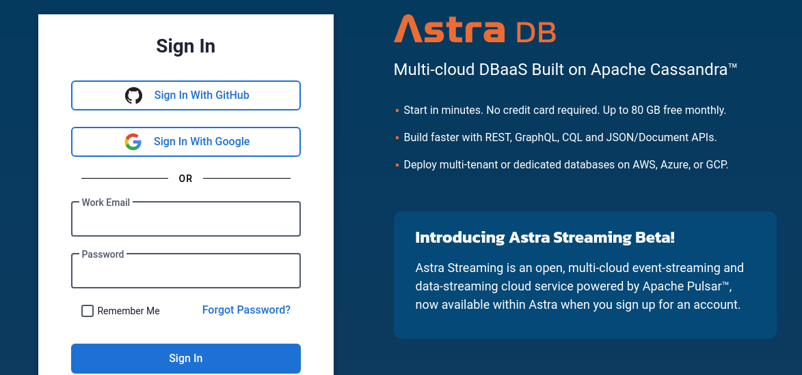
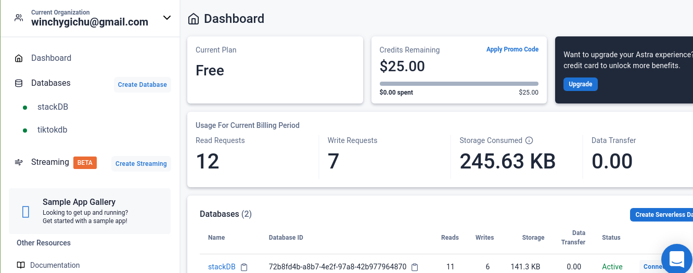
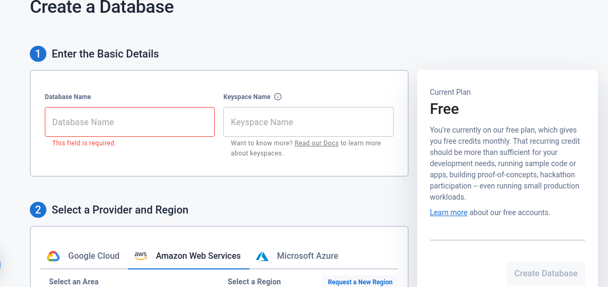
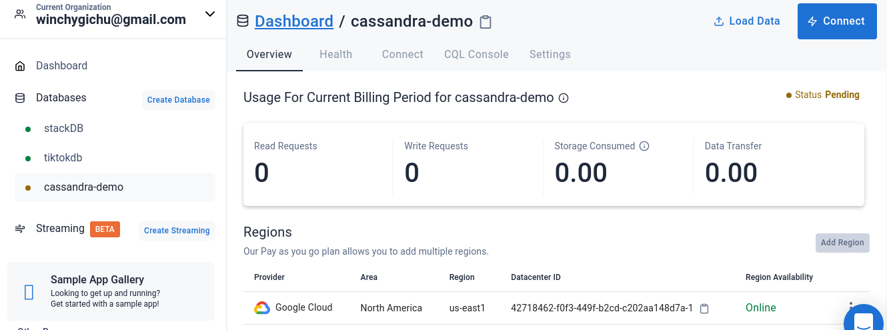
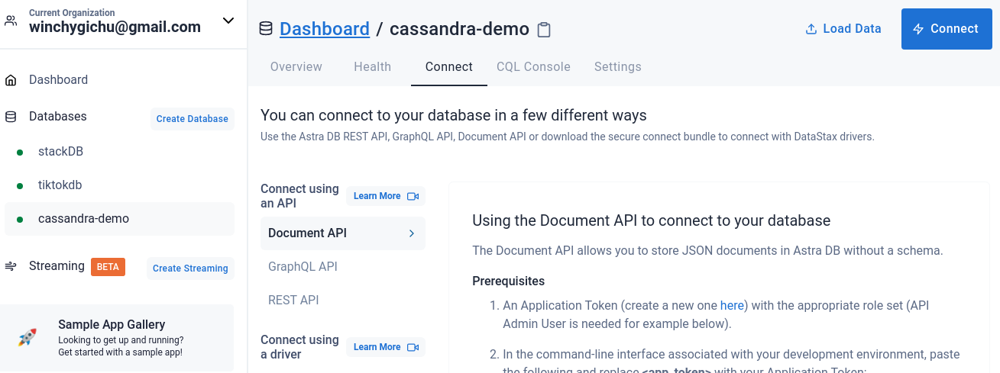
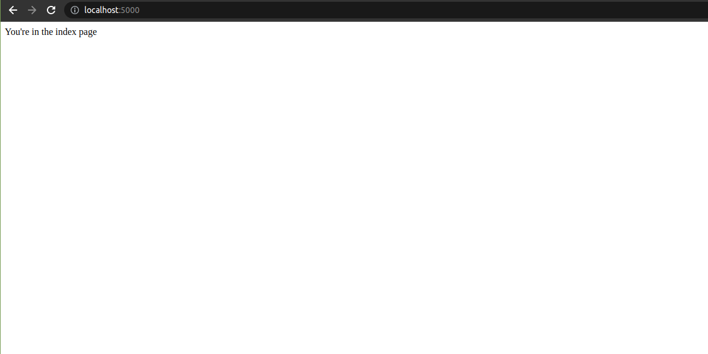

Apache cassandra is distributed No SQL database management system. To ensure reliablility at scale, Apache cassandra relies on replication and partitioning of its infrastructure. However, this form of cloud-native development is normaly complicated. 

This article focuses on the basics of using Apache Cassandra and Astra DB. We will perform CRUD operations on a blog database using Node.js and Datastax's document API. We will create tables, read database records, perform updates, and deletions.


### Prerequisites
1. You'll need an [Astra DB](https://www.datastax.com/products/datastax-astra) account for the database.

2. Have [Node.js] (https://nodejs.org/en/) runtime installed on your development system

3. An IDE, I recommend [VS Code](https://code.visualstudio.com/) for developement. 

### Database Setup

First, you'll need to login to DataStax. I use my GitHub account.However, you connect your Google account or even use email and password.




A successful login will take you to your AstraDB dashboard. On the left panel of the dashboard, click `create database`. 



To create a serverless database, choose a name and a keyspace. Apache Cassandra will use keyspaces to group data together. In my case, I will use `cassandra-demo` as the database name and `blog` as the keyspace.



>>> Documetation refers to keyspace as a bucket that will hold your tables. You can create different keyspaces for groups of tables”. 

Datastax's Astra DB is distributed on different regions. Before completing the database setup, pick a provider from the options. In my case, I will chose GCP and the region as us-east1.




### Insert data to the database
The Apache Cassandra is a NoSQLand therefore it organizes data in collections. When we create a Cassandra collection, it automatically exposes a REST or GraphQL API as an endpoint where we can interact with data from our database. We will utilize the document API gateway from our Node.js application.

First, we need to create a new token for access to DataStax's database in our application. Head over to the DataStax Astra DB dashboard. On the panel, click connect. This shows various ways in cwhich we can access our application including REST and GraphQL APIs. We will use the Document API hence head over under the prerequisites and click the link to create a new Application token.



In this project, we will use the `Administrator role` to access every privilege in the database security. Finally, copy the generated `Client ID`, `Token`, and `Client Secret` and store them on your `env` file.

Since we have no interface created, we will use [curl](https://curl.se/) command line to insert data. 
The curl command to make POST request will be similar to the following:

 ```bash
 curl --request POST \
--url https://$ASTRADB_ID-$ASTRADB_REGION.apps.astra.datastax.com/api/rest/v2/namespaces/$ASTRA_DB_KEYSPACE/collections/members \
-H "X-Cassandra-Token: $ASTRADB_TOKEN" \
-H 'Content-Type: application/json' \
-d '{
"title": "New Title",
"description": "descriptive stuff...",
"author": "john doe"
}'
```
To insert more data, rerun this command with different title and other to insert more data. However, don't forget to change the `title`, `description` and `author` from the json body. 

### Project setup 

On your terminal, create a project folder and name it `astra-app-demo`:

```bash 
mkdir astra-app-demo
```
Next, navigate inside the folder and open it in your IDE:

```bash
cd astra-app-demo && code .
```

To bootstrap this project, initialize using the command `npm init -y` to create a `package.json` file. Let's now install the following dependencies:

Our Node.js application will need the following packages from npm:
- Express : `express` is a low overhead Node.js web application framework that relies on middlewares in request/response cycle.

- @strajs/collections: This is the module that acts as driver to our document [stargate API]() in AstraDB. DataStax uses a Stargate API gateway to connect from Node.js application. 
  
- Dotenv: Since we are using a serverless database, we need a way to store API keys. It injects environment varuables from a `.env` file in our application therefore avoiding hardcoding any sensitive data. Make sure to add a .env in your `.gitignore` file so that this is not pushed to a GitHub repository.
  
- Nodemon: `nodemon` module monitors changes in our application and restarts our application server.

On your terminal, install the packages using the command below:

```bash
  npm i express @astrajs/collections dotenv nodemon
```

If you are using the current version of Node.js, it has support for ES modules. To enable this, head to your package.json and add:

```json
  "type": "module",
```


Next, create an entry `index.js` file inside our `astra-app-demo` directory and add the following code to initiate our server:


```js
// import express and dotenv package installed above
import express from 'express'
import dotenv from 'dotenv'

// instantiate our express app
const app = express()

// enable env varibales for .env file
dotenv.config()

// a basic index route
app.get('/', (req,res)=>{
  res.send("You're in the index page")
})

// run application on Port:: 5000
app.listen(5000, () => {
    console.log(`server running: port:: 5000`)
})
```

Finally, add `nodemon` script in your `package.json` to restart our server:

```json
"scripts": {
    "dev": "nodemon index.js"
  },
```

If everything is okay, head over to your browser on `localhost:5000`. 



Congratulations, the server setup is up and running! In the next sections, we will be manipulating our DataStax Astra database using the Document API and `@astrajs/collections` in Node.js


### Connecting and Retrieving data

Add the same credentials you used in the `curl` commands to insert data, which can now be saved to the `.env.local` file. This file is ignored by `git` so will not be accidentally committed to the repo.

 

`.env.local` should contain something like this

        

ASTRA_DB_APPLICATION_TOKEN=AstraCS:POTImYSWGfviUiTipxrlpmUU:44234cb81d12345b0ff99be999a3b00242d67e4b312fc2e236f73c4e28e3a666
ASTRA_DB_ID=1ef9c44f-2ff3-4d2f-yu0d-edaf2d41a87e
ASTRA_DB_REGION=europe-west1
        

    
Note: the values above will be different for you.


In the api file `pages/api/members.js` we need to replace the hardcoded data with the data from the database.

 

At the top of the file, import `createClient` from `@astrajs/collections` with:

        

const { createClient } = require("@astrajs/collections");
        

    
Inside the `handler` function, we need to create a new instance of the `createClient` function with the environment variables we set earlier, as we do not want to add your private tokens to be added to the code.

        

const astraClient = await createClient({
    astraDatabaseId: process.env.ASTRA_DB_ID,
    astraDatabaseRegion: process.env.ASTRA_DB_REGION,
    applicationToken: process.env.ASTRA_DB_APPLICATION_TOKEN,
});
        

    
For ease of use, we can create a constant for the collection:

        

const membersCollection = astraClient
    .namespace("NextJS")
    .collection("members");
        

    
Then to list all of the members, we use the `find` method with an empty query (object):

        

const members = await membersCollection.find({});
        

    
The data back from AstraDB has the ids as keys, like so:

        

{
  "737fccef-3ec6-48a5-9097-57806f775374": { "github": "eddiejaoude", "location": "Portugal", "name": "Eddie" },
  "ad9bb9c5-b504-4d50-8fc3-02aa6267c3a5": { "github": "mayashavin", "location": "Israel", "name": "Maya" },
  "d6230557-d136-458a-906c-d0139c82d141": { "github": "mfts", "location": "Germany", "name": "Marc" },
  "faa302c4-82d8-4b4f-9633-fefb43158d41": { "github": "kenrick", "location": "Canada", "name": "Kenrick" }
}
        

    
Before we return it, we will need to convert the keys to the actual `id` field using a map.


    
Now the data from our API on the endpoint `/api/members` will have the same structure as before but have the data we inserted earlier by the `curl` commands:

        

[
    {
        "id": "737fccef-3ec6-48a5-9097-57806f775374",
        "github": "eddiejaoude",
        "location": "Portugal",
        "name": "Eddie"
    },
    { 
        "id": "ad9bb9c5-b504-4d50-8fc3-02aa6267c3a5",
        "github": "mayashavin", 
        "location": "Israel", 
        "name": "Maya" 
    }
]

        

    
Note: as we are now using `await`, we also need to add `async` to the top of the function definition.

 

The final code should resemble this:

        

const { createClient } = require("@astrajs/collections");

export default async function handler(req, res) {
  const astraClient = await createClient({
    astraDatabaseId: process.env.ASTRA_DB_ID,
    astraDatabaseRegion: process.env.ASTRA_DB_REGION,
    applicationToken: process.env.ASTRA_DB_APPLICATION_TOKEN,
  });

  const membersCollection = astraClient
    .namespace("NextJS")
    .collection("members");

  members = await membersCollection.find({});

  res.status(200).json(
    Object.keys(members).map((key) => {
      return {
        id: key,
        ...members[key],
      };
    })
  );
}

        

    
Here is the documentation on `astrajs` if you would like to read more: https://docs.datastax.com/en/astra/docs/astra-collection-client.html


Preview of the final fullstack application built using NextJS and DataStax with the help of Copilot
In the following sections I will provide a brief explanation and description of the tools we will be using.

 

What is NextJS?

 

Next.js is a React-based framework for building production-ready web applications that gives you the best developer experience with all the features you need for production: hybrid static and server rendering, TypeScript support, smart bundling and route pre-fetching, to name a few.

 

If you would like to see a full list of features, then check out their features page.

 

What is DataStax's AstraDB?

 

DataStax built a Data API gateway into Astra to give app developers a natural data API stack which meshes with the Jamstack (or any JavaScript frontend stack of your choice). Astra is built on the rock solid NoSQL data engine (Apache Cassandra) which powers Netflix, Fedex, Yelp, iCloud and other apps we all use every day. Cassandra is an open source project - no surprises there, this is me!

 

There are multiple ways to connect and work with your data; from RESTful API over http, GraphQL to Cassandra QL. In this tutorial we will be using AstraDB's document API and AstraJS Javascript library.

 

But why use Next.js and Astra together in the first place? Jamstack providers can make your app available via a CDN / edge network in seconds, and you've gone from desktop to cloud worldwide deployment, anywhere. But what about the data? That's what Astra DB gives you. It's a perfect companion to Jamstack apps as it brings data to your app, at commercial - internet levels of scale, reliability and performance on any cloud using straightforward JavaScript.


When creating the app example code was added. I would suggest you remove the existing example html/css, so that you can have a cleaner page. 

 

The next step is to hard code a list of items on the page. Start with the basic html ul, which is an unordered list and li is the list item (we will style this up later on).

 
We will now move the hard code data from the UI to the API, so that the UI will be updated dynamically. At a later stage, we will connect the API to the database to have a real fullstack app.

 

The files inside the folder pages/api are special as they are mapped to the url path /api/* (for example, the file pages/api/members.js would be reachable on /api/members) and will be treated as an API endpoint instead of a page.

 

In your app there will be a file that was created as part of the app creation command pages/api/hello.js. This will be mapped to GET /api/hello - which you can visit in your browser on http://localhost:3000/api/hello.

 

Create the file pages/api/members.js with the following content, which will return a status 200 and two member objects in a collection each with the following fields: id, name, location, github.

 

        

export default function handler(req, res) {
  res.status(200).json([
    {
      id: 1,
      name: "John Doe",
      location: "London",
      github: "john-doe"
    },
    {
      id: 2,
      name: "Jane Doe",
      location: "New York",
      github: "jane-doe"
    },
  ]);
}
        

    
If you have Copilot you will see it start to autocomplete the code for you:


Then if you go to the url http://localhost:3000/api/members you should see the following json response:

        


    
`members` will start out as an empty array `[]` and `setMembers` will be called with the data from the API and populate the `members` variable with the data returned.

 

Here you will see GitHub Copilot completing the useEffect for us in grey, and we can accept its changes by pressing tab.


Data from the API
 

Creating the NoSQL Database

 

The first part of the coding implementation will be to get data, so we need to manually insert some data so we can query for it in our code. Or if you are feeling brave and adventurous you could jump ahead to adding the form that creates data.

 

Log in to DataStax. I prefer to log in using my GitHub account, but you can create a new account if you wish or even log in with your Google account if you have one.


Next we will want to create a database, which is done by clicking on `Create Database` on your dashboard after logging in.


Then you will be given the chance to choose a name for the database and a keyspace - more keyspaces can be added later.

 

Keyspaces are for grouping data together, for example, different clients. From DataStax’s docs: “a keyspace is like a bucket that holds your tables. You can create different keyspaces for groups of tables”. Also, pick one of the providers you would like to use, such as AWS, Google Cloud or Azure.


Insert data in to the database via the CLI

 

As we have not created the form to insert data yet, we can manually insert data using the curl command.

 

Note: replace `$ASTRA_DB_ID`, `$ASTRA_DB_REGION`, `$ASTRA_DB_KEYSPACE`, `$ASTRA_DB_APPLICATION_TOKEN` with your values from your AstraDB dashboard.

 

You will need to create a token for your application. This can be done from the DataStax dashboard, under "organizations". When creating the token, you can use the “Database Administrator” role for this situation. However, I recommend using the minimum permissions required to achieve what you need.


This is an example from DataStax's documentation:

        

curl --request POST \
--url https://$ASTRA_DB_ID-$ASTRA_DB_REGION.apps.astra.datastax.com/api/rest/v2/namespaces/$ASTRA_DB_KEYSPACE/collections/members \
-H "X-Cassandra-Token: $ASTRA_DB_APPLICATION_TOKEN" \
-H 'Content-Type: application/json' \
-d '{
"title": "Some Stuff",
"other": "This is nonsensical stuff."
}'

        

    
Here is the curl command I will use: (with example tokens)

        

curl --request POST \
--url https://5df9c04f-2ff4-4d2f-ee0d-edaf2d41a18e-europe-west1.apps.astra.datastax.com/api/rest/v2/namespaces/NextJS/collections/members \
-H "X-Cassandra-Token: AstraCS:POTImYSWGfviUiTipxrlpmUU:44666cb81d74675b0ff99be897a3b00242d67e4b312fc2e9786f73c4e28e3d777" \
-H 'Content-Type: application/json' \
-d '{
"name": "Manually inserting data",
"github": "manual-test",
"location": "Space"
}'

        

    
You can run this multiple times to insert multiple data. However, don't forget to change the `name`, `github` and `location` values in the json body that is sent with the curl command, so you can have some variety in the data stored in the database.

 

Connecting to the AstraDB database

 

We will now be connecting to the NoSQL database AstraDB, to remove the hardcoded data in the API, to make the data dynamic.

 

Install the `astrajs` library, by adding `@astrajs/collections` to your project dependencies on the cli with in your terminal: 

        

npm install @astrajs/collections
        

    
Add the same credentials you used in the `curl` commands to insert data, which can now be saved to the `.env.local` file. This file is ignored by `git` so will not be accidentally committed to the repo.

 

`.env.local` should contain something like this

        

ASTRA_DB_APPLICATION_TOKEN=AstraCS:POTImYSWGfviUiTipxrlpmUU:44234cb81d12345b0ff99be999a3b00242d67e4b312fc2e236f73c4e28e3a666
ASTRA_DB_ID=1ef9c44f-2ff3-4d2f-yu0d-edaf2d41a87e
ASTRA_DB_REGION=europe-west1
        

    
Note: the values above will be different for you.

 

Remember to restart your application to pick up the new environment variables.

 

Retrieving data

 

In the api file `pages/api/members.js` we need to replace the hardcoded data with the data from the database.

 

At the top of the file, import `createClient` from `@astrajs/collections` with:

        

const { createClient } = require("@astrajs/collections");
        

    
Inside the `handler` function, we need to create a new instance of the `createClient` function with the environment variables we set earlier, as we do not want to add your private tokens to be added to the code.

        

const astraClient = await createClient({
    astraDatabaseId: process.env.ASTRA_DB_ID,
    astraDatabaseRegion: process.env.ASTRA_DB_REGION,
    applicationToken: process.env.ASTRA_DB_APPLICATION_TOKEN,
});
        

    
For ease of use, we can create a constant for the collection:

        

const membersCollection = astraClient
    .namespace("NextJS")
    .collection("members");
        

    
Then to list all of the members, we use the `find` method with an empty query (object):

        

const members = await membersCollection.find({});
        

    
The data back from AstraDB has the ids as keys, like so:

        

{
  "737fccef-3ec6-48a5-9097-57806f775374": { "github": "eddiejaoude", "location": "Portugal", "name": "Eddie" },
  "ad9bb9c5-b504-4d50-8fc3-02aa6267c3a5": { "github": "mayashavin", "location": "Israel", "name": "Maya" },
  "d6230557-d136-458a-906c-d0139c82d141": { "github": "mfts", "location": "Germany", "name": "Marc" },
  "faa302c4-82d8-4b4f-9633-fefb43158d41": { "github": "kenrick", "location": "Canada", "name": "Kenrick" }
}
        

    
Before we return it, we will need to convert the keys to the actual `id` field using a map.

        

res.status(200).json(
    Object.keys(members).map((key) => {
      return {
        id: key,
        ...members[key],
      };
    })
  );
        

    
Now the data from our API on the endpoint `/api/members` will have the same structure as before but have the data we inserted earlier by the `curl` commands:

        

[
    {
        "id": "737fccef-3ec6-48a5-9097-57806f775374",
        "github": "eddiejaoude",
        "location": "Portugal",
        "name": "Eddie"
    },
    { 
        "id": "ad9bb9c5-b504-4d50-8fc3-02aa6267c3a5",
        "github": "mayashavin", 
        "location": "Israel", 
        "name": "Maya" 
    }
]

        

    
Note: as we are now using `await`, we also need to add `async` to the top of the function definition.

 

The final code should resemble this:

        

const { createClient } = require("@astrajs/collections");

export default async function handler(req, res) {
  const astraClient = await createClient({
    astraDatabaseId: process.env.ASTRA_DB_ID,
    astraDatabaseRegion: process.env.ASTRA_DB_REGION,
    applicationToken: process.env.ASTRA_DB_APPLICATION_TOKEN,
  });

  const membersCollection = astraClient
    .namespace("NextJS")
    .collection("members");

  members = await membersCollection.find({});

  res.status(200).json(
    Object.keys(members).map((key) => {
      return {
        id: key,
        ...members[key],
      };
    })
  );
}

        

    
Here is the documentation on `astrajs` if you would like to read more: https://docs.datastax.com/en/astra/docs/astra-collection-client.html

 

Basic styling

 

We will use bootstrap to style the list on the page, so that we can customise it further without writing all the custom styles from scratch. 

 

You may choose to use any other styling framework if you prefer (some common examples are Material or Tailwind) or write it from scratch. 

 

Install the dependency `bootstrap` with the CLI command:

        

npm install react-bootstrap bootstrap
        

    
Add to `pages/index.js`

        

import "bootstrap/dist/css/bootstrap.min.css";
import { ListGroup } from "react-bootstrap";
        

    
Replace the current list from:

        

<ul>
    {members.map((member) => (
    <li key={member.id}> {member.name}, {member.location}, {member.github} </li>
    ))}
</ul>
        

    
To:

        

<ListGroup>
    {members.map((member) => (
    <ListGroup.Item key={member.id}>{member.name}, {member.location}, {member.github}</ListGroup.Item>
    ))}
</ListGroup>
        

    
You can read about bootstrap list groups in their docs here: https://react-bootstrap.github.io/components/list-group/


Form to save data

 

To save data in the database we need to create a form to capture the user input.

 

Import from bootstrap the form components so we can display the form:

        

import { Form, Button, InputGroup, FormControl, ListGroup } from "react-bootstrap";
        

    
Add more state variables to the `pages/index.js` file, so that we can persist the input data:

        

const [name, setName] = useState("");
const [location, setLocation] = useState("");
const [github, setGitHub] = useState("");
        

    
I have chosen to use the inline `InputGroup` from bootstrap, so the form displays on a single line. We will have the trigger `onChange` to update the state variables we created above.

        

<Form inline>
    <InputGroup className="mb-3">
    <FormControl
        type="text"
        placeholder="Name"
        name="name"
        onChange={(e) => setName(e.target.value)}
    />
    <FormControl
        type="text"
        placeholder="Location"
        name="location"
        onChange={(e) => setLocation(e.target.value)}
    />
    <FormControl
        type="text"
        placeholder="GitHub"
        name="github"
        onChange={(e) => setGitHub(e.target.value)}
    />
    <InputGroup.Append>
        <Button variant="outline-secondary">Submit</Button>
    </InputGroup.Append>
    </InputGroup>
</Form>
        

    

Here is the link to look at the full documentation on bootstrap forms: https://react-bootstrap.github.io/components/forms/

 

At the moment, the form button `submit` will not do anything. We need to add an `onClick` event and a function, which will look like this:

        

onClick={submitSave}
        

    
Making the final button be like this:

        

<Button variant="outline-secondary" onClick={submitSave}>
    Button
</Button>
        

    
We then need a function to handle the form submission called `submitSave`. This will look similar to the "get data" function we created earlier in the `useEffect` function. Instead of a `GET` http request, we will be making a `POST` request that will have a body sent with the request of the form data we want to save.

        

const submitSave = (evt) => {
    evt.preventDefault();
    console.log(`Submitting ${name}, ${location}, ${github}`);

    fetch("http://localhost:3000/api/members", {
      method: "POST",
      body: JSON.stringify({ name, location, github }),
    })
      .then((res) => res.json())
      .then((res) => setMembers([...members, res]));
  };
        

    
Now we can submit the data and you will see the network traffic in the browser, but the API does not handle this `POST` request yet.

 

API saving the POST data

 

In the API file `pages/api/members.js` we need to add a `POST` condition before the `GET` we already have.

        

if (req.method === "POST") {
    const post = JSON.parse(req.body);

    const data = {
      name: post.name,
      location: post.location,
      github: post.github,
    };
    console.log(data);
    const newMember = await membersCollection.create(data);

    res.status(201).json({ ...post, id: newMember.documentId });
    return;
  }
        

    
When the new data is saved, the API returns the data with the new document id that was generated by the database. This is so that the UI can decide if it wants to use the new data or not.

 

Below you will see 2 screenshots with the developer tools open on the right. The first screenshot has the request object and the second has the response object. You will see in the response object it is the same as the request object, but has the id from the database.

Most data retrieval uses a WHERE clause containing operators to designate a range of rows to return.

 

The operators available are:

eq (equal)

notEq (not equal) - limited use

gt (greater than)

gte (greater than or equal to)

lt (less than)

lte (less than or equal to)

in (within) - limited use

nin (not within) - limited use

 

The WHERE clause can use any of these operators, as applicable to the data type defined. The storage schema used by the Document API internally indexes all values, so any column can be used with an operator.

 

Another example would be using the `in` operator:

        

members = await membersCollection.find({ name: { $in: [req.query.keyword] } });
        

### Performing updates and deletions


### Conclusion
Being open source, the Cassandra is a popular database due to its ability to maintain seamless scalability and consistency in a distributed cloud infrastructure. Combining this technical features with DataStax stargate API gateway gives us the ability to develop a serverless database with zero configuration. The database is serverless which has a great free tier and developer experience.

Along with your free account, you also get an additional 25 USD of usage credit (at time of writing) each month to use after that.

I hope you enjoy this article.